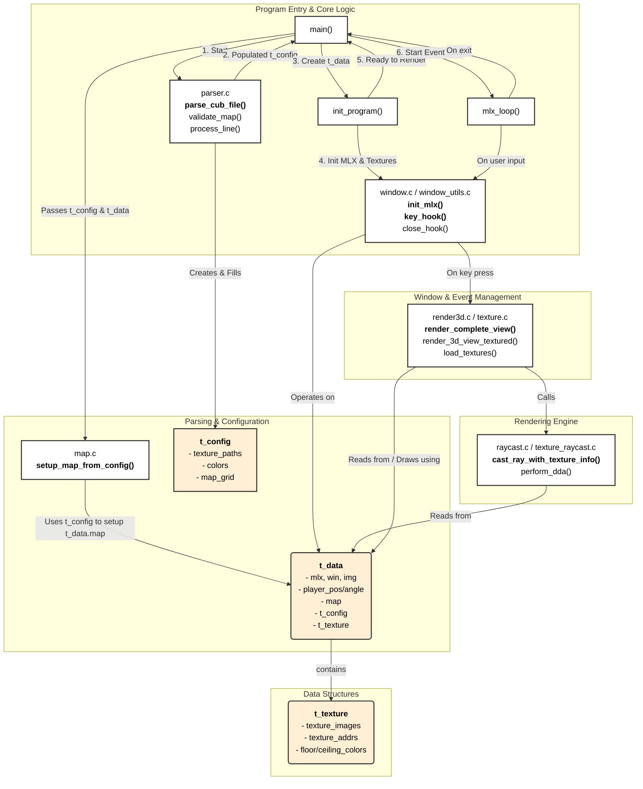

# cub3d Program Explanation

This document provides a detailed explanation of the `cub3d` program's architecture, data structures, and execution flow.

## 1. Overview

The `cub3d` project is a 3D graphics application that renders a maze-like environment based on a 2D map file. It uses a technique called **raycasting** to create a 3D perspective from a first-person point of view, similar to the classic game Wolfenstein 3D. The program is built using the C programming language and the MiniLibX graphics library.

The key features of the program include:
- Parsing a `.cub` scene description file that defines the map layout, wall textures, and floor/ceiling colors.
- Rendering a 2D minimap and a 3D first-person perspective of the maze.
- Handling user input for player movement and rotation.
- Applying textures to walls and shading for a sense of depth.

## 2. Core Components and Data Structures

The program's state is primarily managed by a set of well-defined C structures. The relationships between these structures and the program's components are visualized in the detailed diagram below.

### Main Data Structures

- **`t_data`**: This is the central data structure that holds the entire runtime state of the application. It acts as a container for all other important data, including MLX pointers, player information, the map, and textures. An instance of this struct is passed to nearly every function in the program.

- **`t_config`**: This structure stores the configuration data parsed from the `.cub` file. It holds the paths to the four wall textures (North, South, East, West), the RGB values for the floor and ceiling colors, and a `char**` grid representing the map layout.

- **`t_texture`**: This structure manages all texture-related data. It holds pointers to the loaded MLX texture images, their memory addresses for pixel access, and the pre-calculated integer values for the floor and ceiling colors.

- **`t_ray`**: A temporary structure used during the raycasting process. It holds all the necessary variables for a single ray, such as its angle, position, direction, and the results of the DDA algorithm.

### Detailed Architecture Diagram

The following diagram provides a comprehensive blueprint of the application, showing how the core data structures are created, passed between, and used by the different functional components.

## 3. Execution Flow

The program executes in a clear sequence of phases: Parsing, Initialization, Rendering, and Event Handling.

### Phase 1: Parsing and Validation

1.  **Entry Point**: Execution begins in the `main` function (`src/main.c`). It checks for a single command-line argument: the path to a `.cub` file.
2.  **File Parsing**: The `parse_cub_file` function (`src/parser.c`) is called to process the scene file.
    - It validates the `.cub` file extension.
    - It reads the file line by line, parsing texture paths and color definitions. This information is stored in the `t_config` struct.
    - Once the configuration lines are read, it parses the map layout, storing it temporarily.
3.  **Map Validation**: After parsing, the map is rigorously validated:
    - `find_and_validate_player_position` ensures there is exactly one player starting position ('N', 'S', 'E', or 'W').
    - `validate_map` checks that the map is "closed" – i.e., completely surrounded by walls ('1') to prevent the player from escaping the defined area.
4.  **Finalizing Config**: The player's starting character on the map is replaced with a floor tile ('0'), and the final padded map is stored in `config.map_grid`.

### Phase 2: Initialization

1.  **Map Setup**: Back in `main`, `setup_map_from_config` (`src/map.c`) is called. It converts the `char**` map from `t_config` into a more efficient `int*` array in the `t_data` struct. It also calculates the player's initial pixel coordinates and viewing angle.
2.  **Graphics Initialization**: The `init_program` function (`src/main.c`) sets up the graphical environment.
    - `init_mlx` (`src/window_utils.c`) initializes the MiniLibX library, creates a window, and prepares an image buffer for drawing.
    - `init_textures` (`src/window_utils.c`) calls `load_textures` to load the XPM wall textures into memory and converts the parsed RGB floor/ceiling colors into single integer values.

### Phase 3: Rendering and The Main Loop

1.  **Initial Render**: `render_complete_view` (`src/window_utils.c`) is called to draw the first frame. This is the main rendering hub.
2.  **Event Hooks**: `mlx_hook` is used to register callback functions for user input:
    - `key_hook` (`src/window.c`) listens for keyboard presses.
    - `close_hook` (`src/window.c`) listens for the window's close button.
3.  **Main Loop**: `mlx_loop(img.mlx)` starts the MiniLibX event loop. The program now idles, waiting for user input or other events.

#### The Rendering Process in Detail (`render_complete_view`)

This function is called every time the scene needs to be redrawn (e.g., after the player moves).

1.  **Raycasting (`render_3d_view_textured`)**:
    - The function iterates through every vertical column of pixels in the viewport.
    - For each column, a ray is "cast" from the player's position into the scene at a specific angle.
    - **DDA Algorithm**: The `cast_ray_with_texture_info` function uses a Digital Differential Analysis (DDA) algorithm. This is a fast algorithm for traversing a grid. It extends the ray from grid line to grid line until it collides with a wall block ('1').
    - **Distance Calculation**: Once a wall is hit, the perpendicular distance from the player to the wall is calculated. This is crucial to prevent a "fisheye" lens distortion effect.

2.  **Wall Drawing (`draw_textured_wall_slice`)**:
    - Based on the calculated distance, the height of the wall slice for the current screen column is determined (closer walls appear taller).
    - The function then draws this vertical slice pixel by pixel:
        - **Ceiling and Floor**: The space above and below the wall slice is filled with the ceiling and floor colors, respectively.
        - **Texture Mapping**: For each pixel of the wall slice, the corresponding horizontal coordinate on the wall texture (`tex_x`) is calculated. The vertical texture coordinate (`tex_y`) is determined by scaling the pixel's position along the slice.
        - **Pixel Coloring**: `get_texture_pixel` retrieves the color from the appropriate wall texture data. A shading effect is applied to make distant walls appear darker, enhancing the sense of depth.
        - The final calculated pixel color is written to the image buffer using `my_mlx_pixel_put`.

3.  **Display**: After all columns have been drawn, `mlx_put_image_to_window` displays the completed image buffer in the window.

### Phase 4: User Interaction and State Updates

- When the user presses a key (e.g., 'W', 'A', 'S', 'D', or arrow keys), the `key_hook` function is triggered.
- It updates the player's position (`player_x`, `player_y`) or angle (`player_angle`) in the `t_data` struct.
- Collision detection is performed by the `is_wall` function to prevent the player from moving through walls.
- After the player's state is updated, `render_complete_view` is called again to redraw the scene from the new perspective. This cycle of input -> update -> render continues until the user exits the program.

### Phase 5: Cleanup

- When the user presses `ESC` or closes the window, `mlx_loop` terminates.
- The `cleanup_program` function is called to free all dynamically allocated memory, including the config data, MLX textures, the window, and the image, ensuring no memory leaks. 